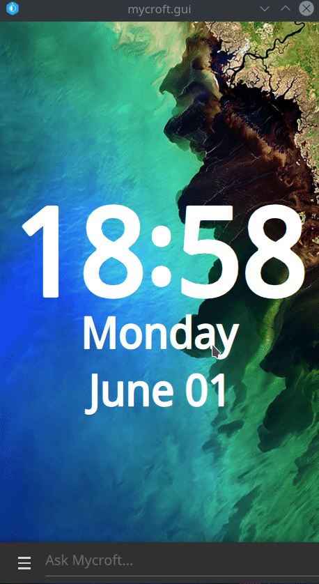

# VOIP skill

Add VOIP capabilities to Mycroft using Baresip



# Install

## MSM

The skill can be easily installed with Mycroft Skill Manager

```bash
msm install https://github.com/JarbasSkills/skill-voip
```

## Mark1

If you are using a mark1 msm will fail

Baresip is not in raspbian jessie repositories, you need to install the old fashioned way

First we need to build some things from source

*Libre is a portable and generic library for real-time communications with async IO support and a complete SIP stack with support for SDP, RTP/RTCP, STUN/TURN/ICE, BFCP and DNS Client.*

Download & Unpack the latest stable package from http://creytiv.com/pub/

*Example: re-latest.tar.gz*

```bash
pi@mark_1:~ $ cd re
pi@mark_1:~ $ make
pi@mark_1:~ $ sudo make install
pi@mark_1:~ $ sudo ldconfig
```

*Librem is a portable and generic library for real-time audio and video processing.*

Download & Unpack the latest stable package from http://creytiv.com/pub/

*Example: rem-latest.tar.gz*

```bash
pi@mark_1:~ $ cd rem
pi@mark_1:~ $ make
pi@mark_1:~ $ sudo make install
pi@mark_1:~ $ sudo ldconfig

```

*Baresip is a portable and modular SIP User-Agent with audio and video support.*

Clone the latest GIT version:
```bash
pi@mark_1:~ $ git clone https://github.com/alfredh/baresip
pi@mark_1:~ $ cd baresip
pi@mark_1:~ $ make
pi@mark_1:~ $ sudo make install
```

Now to install the actual skill

```bash
pi@mark_1:~ $ cd opt/mycroft/skills
pi@mark_1:~ $ git clone https://github.com/JarbasSkills/skill-voip
pi@mark_1:~ $ cd skill--voip
pi@mark_1:~ $ mycroft-pip install -r requirements.txt
```


# Usage

## Credentials

You can either configure credentials in Baresip or use mycroft.home.ai (your credentials will be exposed)

    TODO guide for both approaches

You can get free SIP accounts at https://sip2sip.info or https://www.antisip.com

NOTE: I am NOT recommending a specific SIP provider, I found these with a simple google search and verified they work

NOTE: for linphone users, outgoing calls work but incoming calls dont, see [flexisip/issues/95](https://github.com/BelledonneCommunications/flexisip/issues/95)

## Contacts List

You can add contacts under home.mycroft.ai (no privacy!) or manually edit the json file at ```~/.baresip/mycroft_sip```

    TODO guide for both approaches

## Intents

X is assumed to be a previously configured contact

- call X
- call X and say Y
- accept call
- accept call and say Y
- hang up
- reject call
- hold call
- resume call
- mute call
- unmute call
- answer all calls
- answer all calls with Y
- reject all calls
- Do not handle calls automatically
- how many contacts
- List contacts
- Call status

There also a few admin/debug intents, you should never need to use these

- restart sip
- sip login


# Known issues

- There is an issue with mycroft backend, it will overwrite any changes you 
make to skill settings, for now avoid setting auto-answer etc by voice and 
use the web ui only

# Credits

This work as been sponsored by Matt Keys, [eZuce Inc](https://ezuce.com/)

The GUI was made by [AIIX](https://github.com/AIIX/)